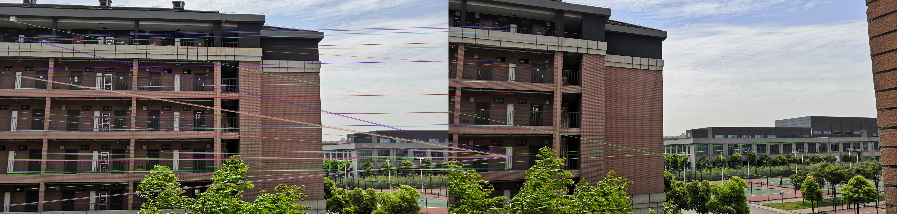

# 计算机视觉练习01-图像拼接报告

## 图像拼接实现说明

通过sift提取图片的关键点和描述子，然后进行特征点匹配，根据匹配点对，计算视角变换矩阵H，使用透视变换将右侧图像根据矩阵H进行变换，得到适应左侧图像的纹理。然后使用拉普拉斯金字塔进行图像融合，得到最终的结果。

更详细步骤于注释中

## 结果

### 图组a

原图像匹配：

---

结果：

### 图组b

原图像匹配：

---

结果：

## 运行说明

于jupyter notebook运行全部cell，运行后会以imshow形式弹出中间结果，按任意键关闭窗口并继续执行。
``image``文件夹自带两组图像``a1.jpg/a2.jpg``和``b1.jpg/b2.jpg``，可自行修改、添加读入的图像。

输出7张图片到程序所在位置的``res_dir``文件夹：
- 1张匹配图01_matches
- 1张变换图02_warp
- 1张无融合结果图03_res_raw
- 2张融合素材04_asm1/05_asm2
- 1张融合结果图06_res_blend
- 1张裁剪后的融合结果图07_result

## 关键点检测算法DoG

DoG（Difference of Gaussians）是一种常用的关键点检测算法之一，用于在图像中检测出具有显著变化的特征点。它基于图像的尺度空间表示，通过计算高斯平滑图像之间的差异来寻找特征点，能够对图像中的边缘、角点、斑点等特征进行检测和描述。。

DoG算法的基本步骤：

1. 尺度空间构建
使用一系列不同尺度的高斯滤波器对输入图像进行平滑处理，得到一组图像，称为尺度空间金字塔。每个尺度层都对应一个特定的高斯平滑程度。

2. DoG图像计算
在尺度空间金字塔中的相邻层之间进行差分操作，得到一组DoG图像。DoG图像是通过相邻尺度层之间的像素差异计算得到的。

3. 关键点检测
在DoG图像中，通过比较像素与其相邻像素以及尺度空间中的其他像素，寻找局部极值点作为候选关键点。局部极值点是在尺度空间和像素坐标两个维度上具有最大或最小值的点。

4. 关键点精确定位
对候选关键点进行精确定位，通常使用插值方法来估计关键点的精确位置和尺度。

5. 关键点方向分配
为每个关键点分配一个主导方向或多个方向。通常使用局部图像梯度方向来确定关键点的主导方向。

## 尺度变化不变特征SIFT

SIFT（Scale-Invariant Feature Transform）是一种经典的尺度变化不变特征提取算法，用于检测和描述图像中的关键点。SIFT算法与DoG（Difference of Gaussians）密切相关，甚至可以说SIFT是基于DoG算法的改进和扩展。

SIFT算法的基本步骤：

1. 尺度空间极值点检测
在尺度空间中，通过在DoG图像中寻找局部极值点来检测关键点。这些局部极值点通常表示图像中的角点、边缘等显著特征。

2. 关键点定位
   对检测到的局部极值点进行精确定位，以确定关键点的准确位置和尺度。在关键点定位阶段，根据DoG图像的近似二阶导数（Hessian矩阵）来估计关键点的位置和尺度。

3. 方向分配
   为每个关键点分配一个主导方向或多个方向。通过在关键点周围的图像区域计算梯度方向直方图，选择主导方向作为关键点的方向描述。

4. 关键点描述
   基于关键点的尺度和方向，提取关键点周围的局部图像区域，构建特征描述子。SIFT特征描述子使用关键点周围的像素梯度信息，通过计算梯度幅值和方向直方图来描述关键点的局部特征。

通过以上步骤，SIFT算法能够提取出具有尺度不变性和旋转不变性的特征描述子，从而使得这些特征可以在不同尺度、旋转和视角下保持稳定。

在SIFT算法中，DoG图像的构建是关键步骤之一。DoG图像通过在尺度空间金字塔中计算相邻尺度层之间的差分来捕获图像中的特征。SIFT算法通过在DoG图像中检测局部极值点，确定关键点的尺度和位置。因此，可以说SIFT算法是基于DoG算法的改进和扩展，通过进一步的关键点定位、方向分配和特征描述等步骤，提取出具有尺度不变性和旋转不变性的稳定特征描述子。

## 拉普拉斯金字塔图像融合

通过将两张图像的拉普拉斯金字塔进行逐层融合，实现将两张图像的细节和结构进行合并的效果。这种融合方法可以产生自然平滑的过渡，并在保留图像细节的同时消除边缘和突变。

这种方法首先对两张待融合的图像分别构建高斯金字塔，然后在高斯金字塔的每一层上，通过对该层图像进行上采样并与下一层图像进行差分操作，得到拉普拉斯金字塔。拉普拉斯金字塔包含了图像在不同尺度上的细节信息。接着，逐层将两个图像的拉普拉斯金字塔进行融合；对于每一层，将两个金字塔相应层的图像进行加权平均，产生融合后的图像。最后将融合后的图像金字塔进行上采样并与上一层融合图像进行叠加，逐层重建融合图像。最终得到的重建图像即为两张原始图像的融合结果。

拉普拉斯金字塔图像融合方法能够有效地保留图像的细节和结构信息，并实现平滑的过渡，使得融合后的图像具有自然的外观。

