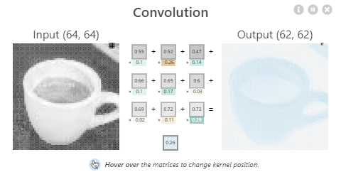
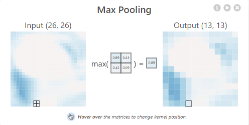
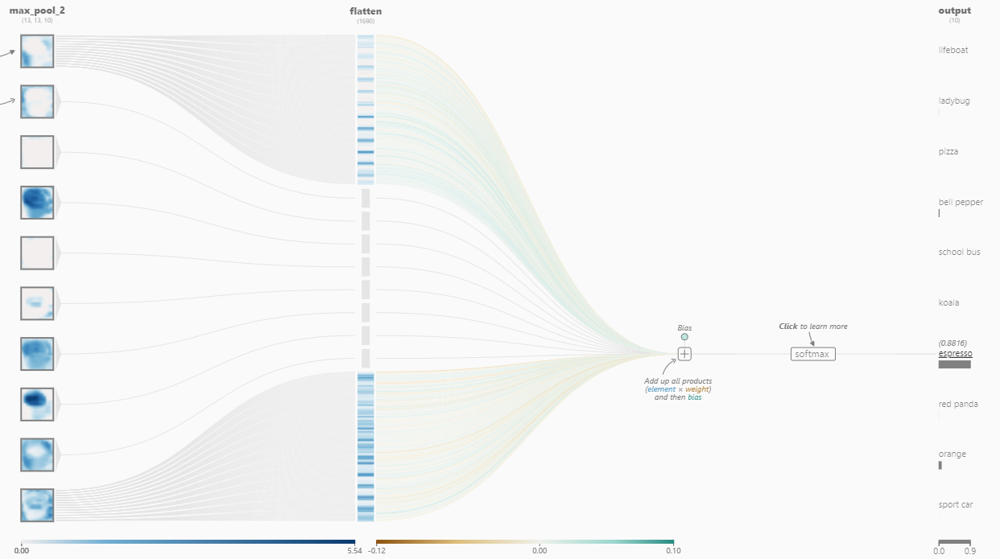
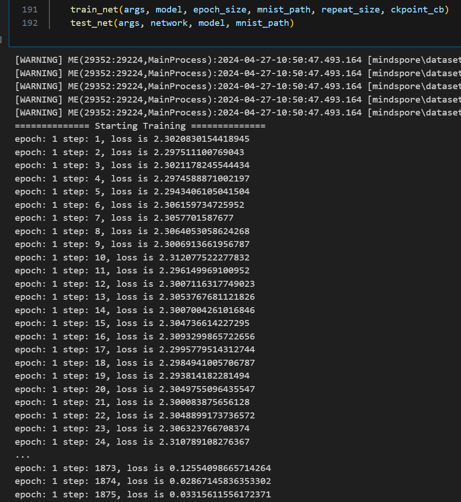
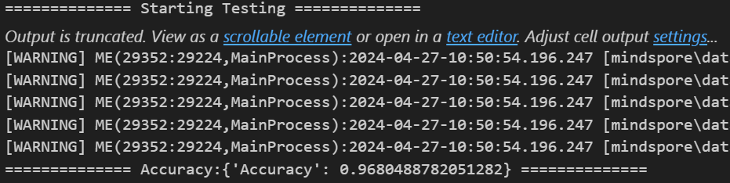

# 计算机视觉实践-练习02-LeNet


## 试用可视化工具-CNN Explainer

https://poloclub.github.io/cnn-explainer/

卷积神经网络(CNN)作为深度学习中的一个关键组成部分，在图像识别、分类和其他视觉任务中发挥着重要作用。然而，CNN的决策过程往往难以理解和解释。为了解决这一问题，CNN Explainer可视化工具旨在通过可视化手段揭示CNN内部的工作机制。

### 1. 概述

CNN Explainer是一个交互式的可视化平台，它允许用户选择图像，并针对特定的输入图像展示网络的决策过程。该工具通过展示卷积层的激活、池化层的输出等，帮助用户理解模型是如何逐步提取特征并做出预测的。

### 2. 试用过程


1. **选择/上传图像**：用户可以选择或上传一张图像，该图像将作为输入数据供CNN模型处理。
2. **可视化卷积**：展示了不同卷积层的激活图，这些激活图反映了图像在不同层次上的特征表示。

3. **可视化池化**：不同的 CNN 架构有很多不同类型的池化层，但它们的目的都是逐渐缩小网络的空间范围，从而降低网络的参数量和整体计算量。这个交互图里使用的池化类型是Max-Pooling，展示了池化操作后的特征图，说明了如何通过池化减少参数数量并保持特征不变。

4. **决策解释**：工具提展示了模型做出最终预测的过程。



<!-- 2. **可视化过程**：
   - **卷积**：展示了不同卷积层的激活图，这些激活图反映了图像在不同层次上的特征表示。
   
   - **池化**：展示了池化操作后的特征图，说明了如何通过池化减少参数数量并保持特征不变性。
    -->

### 3. 总结

CNN Explainer是一个非常有用的工具，它为理解复杂的CNN模型提供了一种直观和互动的方式，它通过可视化帮助我理解CNN的工作原理。通过观察不同层级的激活和权重，我能够对模型的决策过程有了更深入的认识。该工具的交互性设计使得探索过程既有趣又富有教育意义，此外基于Web的平台特性，使得它无需安装或配置即可允许，方便了人们在多种设备上使用。


## LeNet + MNIST

### 1. 准备数据集

于http://yann.lecun.com/exdb/mnist/ 下载MNIST数据集。并解压、按照如下目录存放：

```
./MNIST
├── test
│   ├── t10k-images-idx3-ubyte
│   └── t10k-labels-idx1-ubyte
└── train
    ├── train-images-idx3-ubyte
    └── train-labels-idx1-ubyte
```

### 2. 定义网络


根据LeNet的结构，使用``mindspore``构建网络。

```python
class LeNet5(nn.Cell):
    #define the operator required
    def __init__(self):
        super(LeNet5, self).__init__()
        self.batch_size = 32
        self.conv1 = conv(1, 6, 5)
        self.conv2 = conv(6, 16, 5)
        self.fc1 = fc_with_initialize(16 * 5 * 5, 120)
        self.fc2 = fc_with_initialize(120, 84)
        self.fc3 = fc_with_initialize(84, 10)
        self.relu = nn.ReLU()
        self.max_pool2d = nn.MaxPool2d(kernel_size=2, stride=2)
        self.reshape = P.Reshape()

    #use the preceding operators to construct networks
    def construct(self, x):
        x = self.conv1(x)
        x = self.relu(x)
        x = self.max_pool2d(x)
        x = self.conv2(x)
        x = self.relu(x)
        x = self.max_pool2d(x)
        x = self.reshape(x, (self.batch_size, -1))
        x = self.fc1(x)
        x = self.relu(x)
        x = self.fc2(x)
        x = self.relu(x)
        x = self.fc3(x)
        return x
```

### 3. 定义损失函数及优化器

MindSpore支持的损失函数有SoftmaxCrossEntropyWithLogits、L1Loss、MSELoss等。这里使用SoftmaxCrossEntropyWithLogits损失函数。

MindSpore支持的优化器有Adam、AdamWeightDecay、Momentum等。这里使用Momentum优化器。

```python
from mindspore.nn.loss import SoftmaxCrossEntropyWithLogits

if __name__ == "__main__":
    ...
    net_loss = SoftmaxCrossEntropyWithLogits(sparse=True, reduction='mean')
    # create the network
    network = LeNet5()
    # define the optimizer
    net_opt = nn.Momentum(network.trainable_params(), lr, momentum)
    ...
```

### 4. 训练

通过model.train接口可以方便地进行网络的训练。


```python
def train_net(args, model, epoch_size, mnist_path, repeat_size, ckpoint_cb):
    """define the training method"""
    print("============== Starting Training ==============")
    #load training dataset
    ds_train = create_dataset(os.path.join(mnist_path, "train"), 32, repeat_size)
    model.train(epoch_size, ds_train, callbacks=[ckpoint_cb, LossMonitor()], dataset_sink_mode=False)
...

if __name__ == "__main__":
    ...

    epoch_size = 1
    mnist_path = "./MNIST_Data"
    repeat_size = epoch_size
    model = Model(network, net_loss, net_opt, metrics={"Accuracy": Accuracy()})
    train_net(args, model, epoch_size, mnist_path, repeat_size, ckpoint_cb)
    ...
```



训练后会得到保存的模型文件``.ckpt``。


### 5. 验证

使用``model.eval()``接口读入测试数据集。使用保存后的模型参数进行推理。

```python
def test_net(args,network,model,mnist_path):
    """define the evaluation method"""
    print("============== Starting Testing ==============")
    #load the saved model for evaluation
    param_dict = load_checkpoint("checkpoint_lenet-1_1875.ckpt")
    #load parameter to the network
    load_param_into_net(network, param_dict)
    #load testing dataset
    ds_eval = create_dataset(os.path.join(mnist_path, "test"))
    acc = model.eval(ds_eval, dataset_sink_mode=False)
    print("============== Accuracy:{} ==============".format(acc))

if __name__ == "__main__":
    ...
    test_net(args, network, model, mnist_path)
```

运行结果如下：



训练1 epoch，测试准确率达到96.8%。


### 运行说明

数据集位于此``README.md``报告同目录下的``./MNIST``。于jupyter notebook运行全部cell即可。

