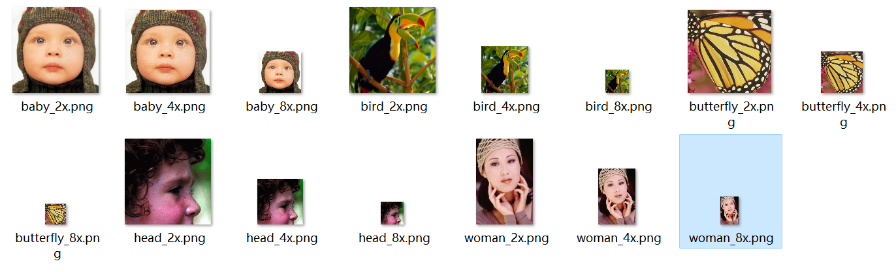
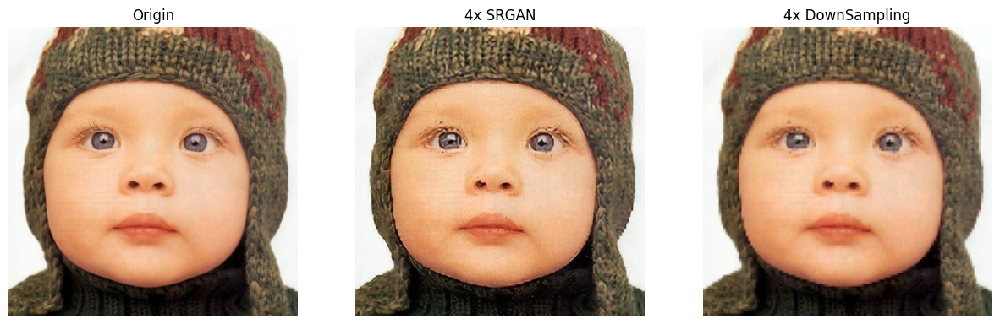
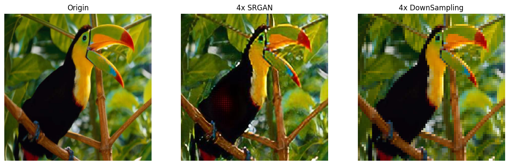
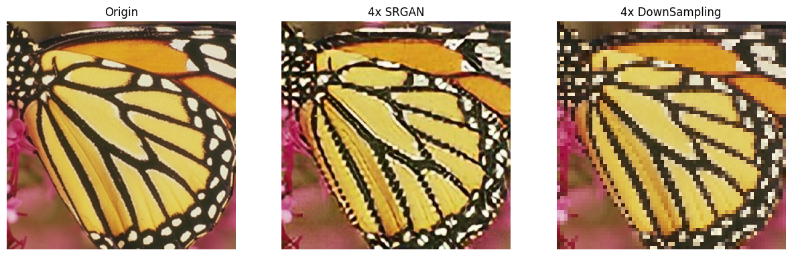
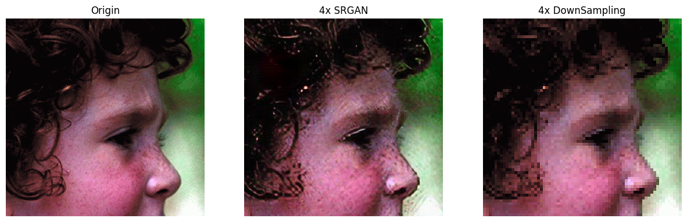
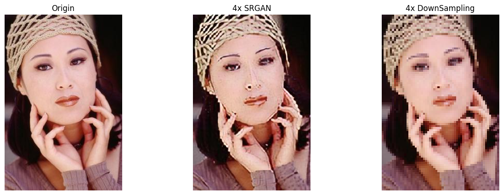

# 计算机视觉实践-练习03-超分辨率

## 1. 下采样

原图缩小后的图像，将缩小后的图像进行超分辨率到原图大小，然后与原图继续比较。

## 2. SRGAN

SRGAN（Super-Resolution Generative Adversarial Network）是一种基于深度学习的图像超分辨率网络。它旨在通过从低分辨率输入图像生成高分辨率图像。

超分辨率是指提高图像的分辨率或细节水平的任务。传统的超分辨率方法通常涉及插值或上采样技术，这可能导致图像模糊或不真实。相比之下，SRGAN利用生成对抗网络（GAN）的思想，通过训练一个生成器网络和一个判别器网络来实现更加逼真的超分辨率图像生成。

SRGAN的关键组成部分是生成器网络和判别器网络。生成器网络接收低分辨率图像作为输入，并生成相应的高分辨率图像。判别器网络则被训练用于区分真实的高分辨率图像和生成器生成的图像。这两个网络相互对抗地进行训练，生成器的目标是生成逼真的高分辨率图像以欺骗判别器，而判别器的目标是尽可能准确地区分真实和生成的图像。

SRGAN采用了一种称为感知损失（perceptual loss）的训练策略，它基于预训练的卷积神经网络（通常是VGG网络）提取的特征来衡量生成图像和真实图像之间的差异。这种感知损失帮助生成器网络学习重建图像细节和纹理，从而产生更加逼真的高分辨率图像。

通过使用SRGAN，可以在保持图像细节和纹理的同时，将低分辨率图像转换为高分辨率图像。这在许多应用中都很有用，比如图像增强、视频处理、医学图像分析等。

SRGAN通过GAN的训练机制，能够生成细节丰富、逼真的高分辨率图像，相比传统方法有更好的视觉效果。但训练过程较复杂，包括生成器网络和判别器网络之间的对抗训练，需要仔细调整超参数和网络结构，以获得良好的结果。同时，由于SRGAN使用深度神经网络，并且需要进行大量的训练迭代，因此训练时间和计算资源消耗相对较大。

因此，研究者可以进一步提高生成图像的质量，如改进生成器网络和判别器网络的结构，结合其他任务和约束（如语义分割和边缘检测）等。同时优化训练策略，提高网络的性能，向实时超分辨率方面进行进步。

## 3. 结果

详细结果位于jupyter notebook文件中。

[.ipynb文件](./assignment03_SR.ipynb)

| 对比    |  PSNR/SSIM    |
|------|---------|
|  | 26.92/0.7584 |
|  | 23.91/0.7166 |
|  | 17.03/0.6148 |
|  | 25.14/0.5573 |
|  | 20.89/0.7418 |

<!-- | 对比    |  PSNR/SSIM    |
|------|---------|
|  | PSNR: 26.92/SSIM: 0.7584 |
|  | PSNR: 23.91/SSIM: 0.7166 |
|  | PSNR: 17.03/SSIM: 0.6148 |
|  | PSNR: 25.14/SSIM: 0.5573 |
|  | PSNR: 20.89/SSIM: 0.7418 | -->

## 运行说明

从https://download-mindspore.osinfra.cn/vision/srgan/ 下载预训练模型``G_model_1000.ckpt``到``./srgan/src/ckpt``下。

于jupyter notebook，先运行图像下采样（已完成可跳过）。然后按照notebook中的描述进入srgan目录进行进行分辨率。

然后回到notebook进行图像的比较和评估

