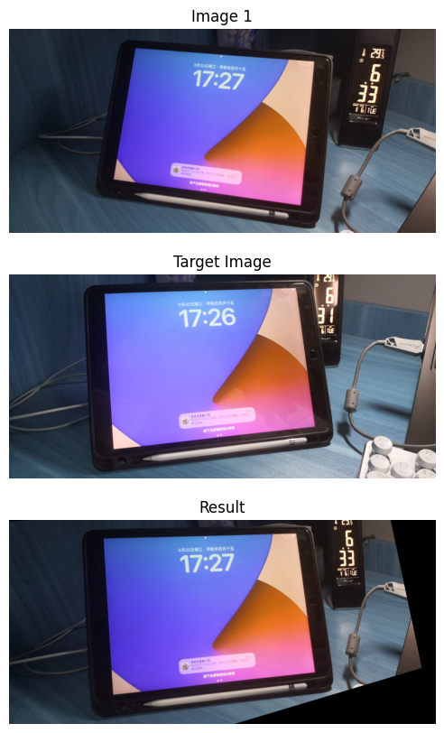

# 计算机视觉实践-练习04-单应性变换

## 1. 单应性变换

单应性变换（Homography）是计算机视觉中描述两个平面之间点映射关系的一种变换。

在数学上，它是一个3x3的矩阵，用于将图像中的点从一个平面映射到另一个平面。单应性变换通常用于图像校正、立体视觉以及图像拼接等领域。

单应性矩阵是一个3x3的矩阵 $H$，它将一个平面上的点 $x$ 映射到另一个平面上的点 $x'$ ，变换关系可以表示为：

$$
x' = Hx
$$

其中， $x$ 和 $x'$ 是齐次坐标下的点，即：

$$
x=\left[\begin{array}{l}
x \\
y \\
1
\end{array}\right], \quad x^{\prime}=\left[\begin{array}{l}
x^{\prime} \\
y^{\prime} \\
1
\end{array}\right]
$$

---

单应性矩阵的计算通常涉及以下步骤：

1. 选择对应点：在两个平面的图像中选择至少四个非共线的对应点对。这些点对在数学上表示为 $\left(x_i, y_i\right)$ 和 $\left(x_i', y_i'\right)$。

2. 建立方程组：对于每一对点，建立以下方程：

$$
\begin{aligned}
x_i^{\prime} &=h_{11} x_i+h_{12} y_i+h_{13} \\
y_i^{\prime} &=h_{21} x_i+h_{22} y_i+h_{23} \\
1 &=h_{31} x_i+h_{32} y_i+h_{33}
\end{aligned}
$$

3. 求解方程组：将上述方程写成矩阵形式，得到一个线性方程组，然后使用最小二乘法或其他数值方法求解这个方程组，得到单应性矩阵 $H$。


## 2. 实验说明


首先读入图像，使用SIFT检测器来获取图像的关键点

```python
# 使用SIFT
sift = cv2.SIFT_create()
keypoints1, descriptors1 = sift.detectAndCompute(image1, None)
keypoints2, descriptors2 = sift.detectAndCompute(image2, None)
```
然后使用FLANN匹配器进行匹配

```python
# FLANN匹配器
index_params = dict(algorithm=0, trees=5)
search_params = dict(checks=50)
flann = cv2.FlannBasedMatcher(index_params, search_params)
rawMatches = flann.knnMatch(descriptors1, descriptors2, k=2)
```

最后通过匹配点对，计算单应性矩阵

```python
# 获取匹配点的坐标
pts1 = np.float32([keypoints1[m.queryIdx].pt for m in matches]).reshape(-1,1,2)
pts2 = np.float32([keypoints2[m.trainIdx].pt for m in matches]).reshape(-1,1,2)

# 计算Homography矩阵
H, _ = cv2.findHomography(pts1, pts2, cv2.RANSAC, 5.0)
```

可以将单应性矩阵应用于图像来观察效果。


## 3. 结果

打印单应性矩阵，详细内容位于jupyter notebook文件中。使用单应性矩阵对图像进行变换，得到的结果保存于``./image/res.jpg``

[.ipynb文件](./assignment04_Homography.ipynb)





结果显示，视角变换符合给出的图像，可以继续执行图像拼接或融合等操作


## 运行说明

于jupyter notebook运行全部cell即可。单应性矩阵和对比结果会打印出来，变换后的图像会存储于``./image/res.jpg``


