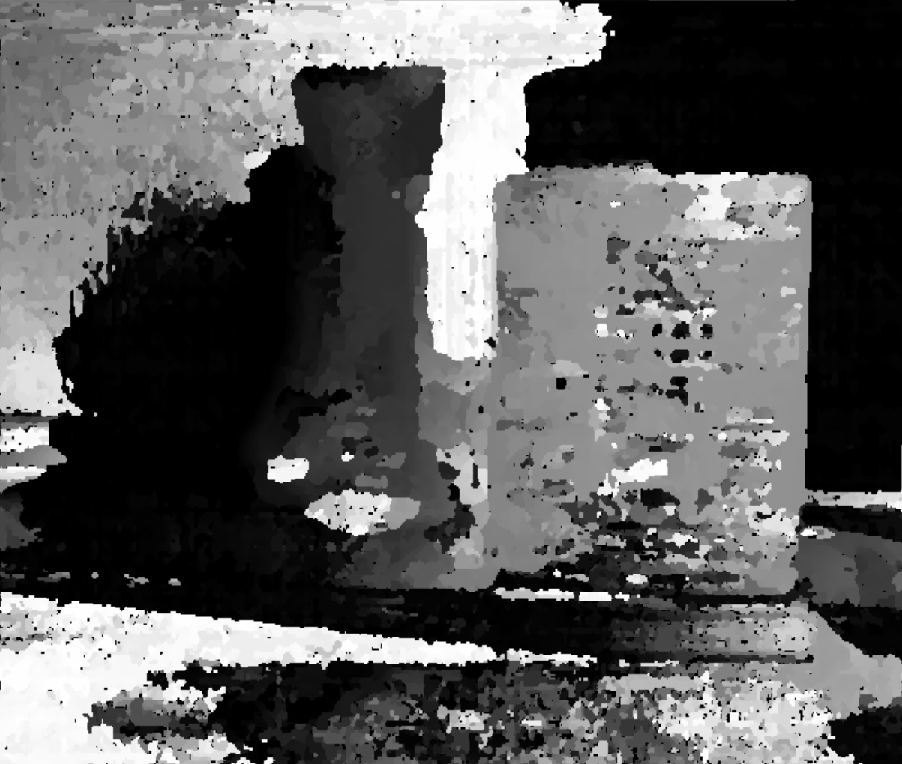
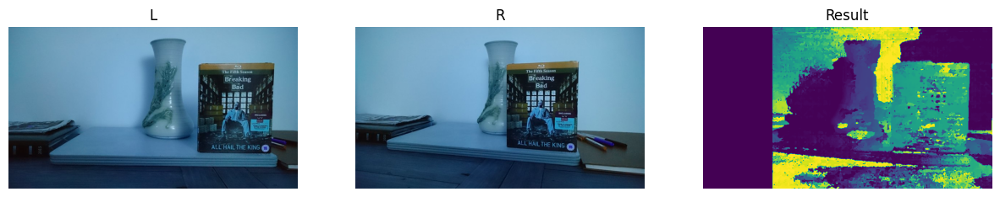
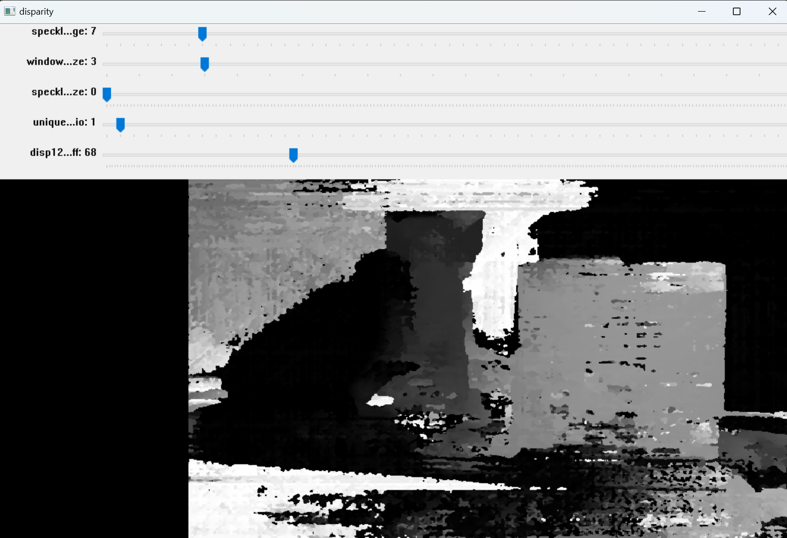

# 计算机视觉实践-练习05-视差匹配

## 1. 视差匹配

立体匹配是计算机视觉中的一项技术，用于从一对或多对图像中恢复三维场景的深度信息。这些图像通常由两个或多个摄像机从不同的角度拍摄同一场景获得，这种方法被称为立体视觉或双目视觉。

立体匹配的基本概念：

> 视差：视差是指同一场景点在左右两个视图中的水平像素差。在立体匹配中，视差与深度成反比，即视差越大，场景点越近；视差越小，场景点越远。
> 
> 深度：深度是指场景中某一点到摄像机的距离。通过计算视差，可以恢复出场景的深度信息。
> 
> 匹配：立体匹配的目的是找到左右视图中相同物理点的对应像素。匹配过程需要考虑图像特征、纹理、光照等因素。

## 2. 实验说明

采用半全局块匹配（SGBM）方法，半全局块匹配方法结合了块匹配和全局优化的思想，通过在图像的不同尺度上搜索最优视差，然后使用全局优化来细化结果。

SGBM的原理可以分为以下几个步骤：

1. 预处理：使用水平Sobel算子对左右图像进行边缘检测，得到梯度图像。

2. 匹配代价计算：对于每个像素，计算其在不同视差下与对应像素的匹配代价，通常使用绝对差或平方差作为代价函数。

3. 能量函数最小化：对于每个像素，定义一个能量函数，包括数据项和平滑项。数据项表示匹配代价，平滑项表示相邻像素的视差连续性。使用动态规划的方法，沿着多个方向（通常为8个或16个）计算累积代价，并求取最小值作为最终代价。

4. 视差图生成：对于每个像素，根据最终代价选择最佳视差，并生成视差图。

5. 视差图后处理：对于视差图中的异常值或空洞，使用一些后处理方法进行修复或填充，例如中值滤波、WLS滤波等。

StereoSGBM用到的几个参数如下

| 参数    |  描述    |
|------|---------|
|minDisparity|	这个参数表示可能的最小视差值。它通常为零，但有时校正算法会移动图像，所以参数值要相应调整|
|numDisparity|	这个参数表示最大视差值与最小视差值的差。这个差值总是大于0 。在当前的实现中，这个值必须要能被16整除|
|windowSize|	这个参数为一个匹配块的大小，他必须是大于等于1的奇数，通常在3~11之间|
|P1|	这个参数是控制视差平滑度的第一个参数。P1是邻近像素间视差变化为1的惩罚值|
|P2|	这个参数是控制视差平滑度的第二个参数。P1是邻近像素间视差变化大于1的惩罚值。这个值越大，视差越平滑。算法要求P2>P1|
|disp12MaxDiff|	这个参数表示左右视差检查中最大允许的偏差（整数像素单位）。设非正值不做检查|
|preFilterCap|	这个参数表示预过滤图像像素的截断值。|
|uniquenessRatio|	这个参数表示由代价函数计算得到的最好（最小）结果值比第二好的值小多少（用百分比表示）|
|speckWindowSize|	这个参数表示平滑视差区域的最大窗口尺寸，以考虑噪声斑点或无效性。将它设为0就不会进行斑点过滤|
|speckleRange|	该参数是指每一个已连接部分的最大视察变化。如果进行斑点过滤，则该参数取正值，函数会自动乘以16|

详细设置于jupyter notebook文件中。

[.ipynb文件](./assignment05_StereoMatching.ipynb)

## 3. 结果

运行第一个cell后显示视差图像和对比结果。视差越小的地方应该有更暗的颜色，意味着更远。

第二个cell提供了交互式调整参数的功能，移动滑块查看不同参数对结果的影响。

## 运行说明

于jupyter notebook运行第一个cell，会弹出得出的视差图，按任意键关闭后会打印出L-R-result的对比图。

运行第二个cell，会弹出一个带有多个参数滑块的窗口，调整滑块以改变SGBM的参数，结果会显示在窗口上。

